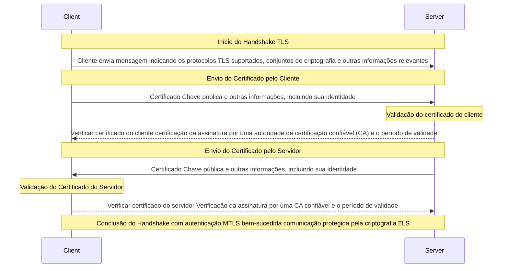

# Conceituando o MTLS

 O MTLS (Mutual Transport Layer Security) é uma extensão do protocolo TLS (Transport Layer Security) que fornece autenticação mútua entre o cliente e o servidor em uma conexão segura. No TLS tradicional, apenas o servidor é autenticado pelo cliente, enquanto o cliente permanece anônimo. Com o MTLS, ambos, cliente e servidor, são autenticados um pelo outro. A autenticação MTLS é realizada durante o processo de handshake TLS, no qual as duas partes (cliente e servidor) trocam informações de certificado digital para confirmar suas identidades. 

 O processo de autenticação do MTLS (Mutual Transport Layer Security) envolve várias etapas, durante as quais tanto o cliente quanto o servidor se autenticam mutuamente usando certificados digitais.




## Casos de Uso

1. **Comunicação Cliente-Servidor em Aplicações Web**:
   - MTLS é amplamente utilizado em aplicações web para garantir a autenticação tanto do cliente quanto do servidor em transações seguras. Isso é especialmente importante em cenários onde dados sensíveis são transferidos, como em aplicações de bancos online, sistemas de comércio eletrônico e plataformas de saúde online.

2. **APIs e Microserviços**:
   - Em arquiteturas de microserviços, onde há comunicação entre diferentes serviços, o MTLS pode ser usado para autenticar cada serviço envolvido na comunicação. Isso garante que apenas os serviços autorizados possam se comunicar entre si, reduzindo o risco de acesso não autorizado.

3. **Autenticação de Dispositivos IoT (Internet das Coisas)**:
   - No contexto da IoT, o MTLS pode ser utilizado para autenticar dispositivos IoT que se conectam a servidores na nuvem. Isso garante que apenas dispositivos confiáveis possam se comunicar com a infraestrutura de back-end, protegendo contra ataques maliciosos e garantindo a integridade dos dados.

4. **Comunicação entre Servidores e Serviços em Nuvem**:
   - Em ambientes de nuvem, onde os serviços são distribuídos entre diferentes provedores e data centers, o MTLS pode ser usado para autenticar a comunicação entre servidores e serviços em nuvem. Isso ajuda a garantir que apenas os serviços autorizados possam acessar recursos específicos na nuvem.

5. **Segurança em Redes Corporativas**:
   - Nas redes corporativas, o MTLS pode ser implementado para garantir a autenticação mútua entre os dispositivos de rede, como roteadores, firewalls e servidores. Isso ajuda a proteger contra ataques de intermediários e garante que apenas dispositivos autorizados possam se comunicar na rede corporativa.


## Implementação

Para a geração dos certificados é necessário a instalação do OpenSSL.

#### 1. Gerando a CA raiz autoassinada

```
openssl req -x509 -sha256 -days 3650 -newkey rsa:4096 -keyout ca.key -out ca.crt
```


```
Observações:

1. Certificados com Extensão .crt:

* Um arquivo com extensão ".crt" é um certificado digital, também conhecido como certificado X.509.
* Contém a chave pública de um servidor ou de uma entidade, juntamente com outras informações como o nome da entidade, o período de validade e a assinatura digital de uma autoridade de certificação (CA).
* Usado para autenticar a identidade de um servidor durante o processo de handshake SSL/TLS.

2. Chaves Privadas com Extensão .key:

* Um arquivo com extensão ".key" contém a chave privada correspondente ao certificado digital.
* Mantida em segredo, a chave privada é usada para descriptografar os dados que foram criptografados com a chave pública correspondente.
* Parte crítica do par de chaves usado na criptografia assimétrica, especialmente no contexto do TLS/SSL, onde é usada pelo servidor para descriptografar os dados recebidos do cliente durante o handshake SSL/TLS.

3. Arquivo .p12

* Um arquivo com a extensão .p12 é um arquivo de contêiner de chave pessoal, também conhecido como arquivo PKCS #12. Este arquivo é usado para armazenar certificados digitais e suas chaves privadas em um único arquivo protegido por senha.

4. Arquivo .jks

* Um arquivo com a extensão .jks é um arquivo de armazenamento de chaves Java KeyStore. Este arquivo é usado principalmente em aplicativos Java para armazenar certificados digitais e suas chaves privadas, bem como outras informações de segurança, como chaves de confiança (truststore) e chaves de autoridades de certificação (CAs).
```

